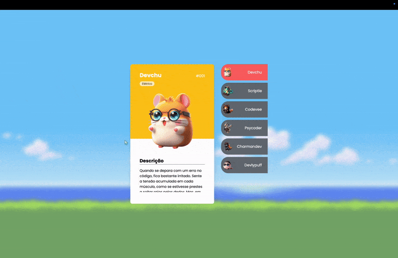
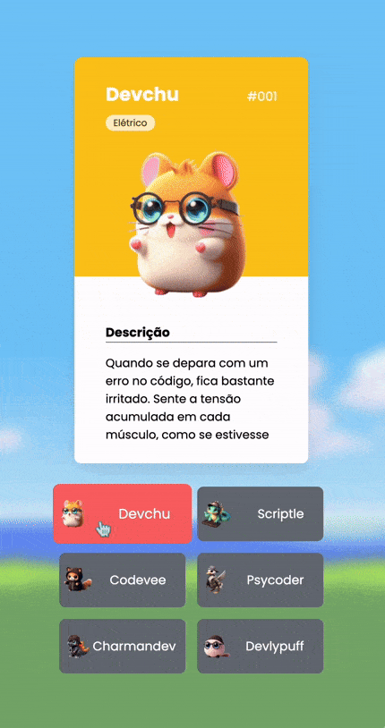

# Projeto Pokedevs

Projeto criado como forma de treinamento no evento "Semana do Programador Contratado", apresentado pelo [DevemDobro](https://github.com/devemdobro).

Ele foi feito de forma responsiva, adequando seu tamanho de forma a atender todos os tamanhos de tela, por meio da utilização do Flexbox. Seu foco é a interatividade e dinamismo que o javascript proporciona, além de seu layout visualmente agradável.

## Tecnologias utilizadas

- HTML

- CSS

- JavaScript

## Preview do site

### Desktop

## Mobile

